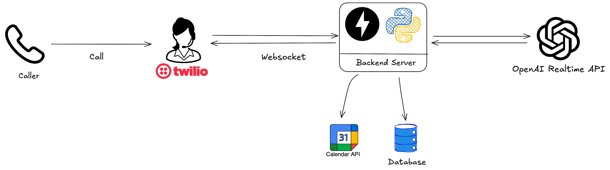

# 🤖 Andy the Sales Agent

Andy is a smart, voice-based AI sales agent designed to handle inbound calls from potential leads, engage them in natural conversation, assess their level of interest, and summarize the call—all autonomously.

Inspired by high-energy sales trainers like **Andy Elliott** (hence the parody), this AI-powered agent goes beyond answering calls. Andy can:

- Handle realistic voice conversations
- Score the interest of the caller
- Summarize entire transcripts into short, digestible notes
- Book test drive appointments
- Send confirmation emails to leads

---

## 🧠 Key Features

- 🎙️ **AI Voice Interaction**: Uses LLMs + voice APIs to converse with leads
- 📝 **Real-time Transcript Summarization**: Post-call summary in natural language
- 📅 **Calendar Integration**: Schedules test drives using Google Calendar (via GCP API)
- 📧 **Email Confirmation**: Automatically sends appointment confirmation emails

---

## 🏗️ System Architecture

Here's a high-level architecture of the full system:

---

## 🚀 Tech Stack

- **LLMs**: OpenAI GPT for summarization and intent analysis
- **Voice**: [Whisper / ElevenLabs / Twilio Voice] (depending on implementation)
- **Scheduling**: Google Calendar API (GCP integration)
- **Email**: SMTP / Gmail API for sending confirmation emails
- **Frontend**: Streamlit or similar (optional for managing appointments)
- **Deployment**: Dockerized microservices, ready for cloud deployment

---

## 📦 Coming Soon

- 🔄 Conversation memory between calls
- 📊 Lead scoring dashboard
- 🔐 Voice authentication and security checks
---

## 📁 Assets

All media and workflow illustrations are available under the `assets/` directory.

---

## 💡 Inspiration

The name *Andy* is a nod to real-world high-pressure sales personas, reimagined as a tireless AI who doesn’t sleep, doesn’t eat—and never forgets a lead.

---

## 📬 Contact

Feel free to reach out for collaborations or questions:

**Aymene Soualem**  
GitHub: [@aymenesoualem](https://github.com/aymenesoualem)

---