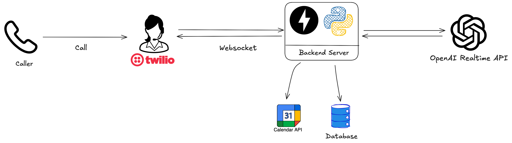

# 🤖 Léa, THOM Group Customer Support Agent

Léa is a smart, voice-based AI customer support agent for **THOM Group** (jewelry & accessories retail group — Histoire d'Or, Marc Orian, AGATHA, Stroili, Ti Sento, and licensed brands like Calvin Klein). She handles inbound customer calls, answers product and order questions, books in-store service appointments, and logs unresolved issues for human follow-up — all autonomously.

Léa goes beyond answering calls. She can:

- Handle realistic voice conversations with customers
- Look up products and check catalog availability
- Check order status by order number
- Find store locations, addresses, phone numbers, and opening hours
- Book in-store service appointments (repair, resizing, engraving, cleaning) with SMS confirmation
- Log a support ticket with a call summary when an issue needs follow-up

---

## 🧠 Key Features

- 🎙️ **AI Voice Interaction**: Realtime speech-to-speech conversations via Azure AI Foundry's Realtime API
- 🔍 **Product & Order Lookup**: Answers product questions and order status from the support database
- 🏬 **Store Locator**: Finds store addresses, phone numbers, and hours by city
- 📅 **Appointment Booking**: Schedules in-store services using Google Calendar
- 📩 **SMS Confirmation**: Sends appointment confirmations via Twilio
- 🎫 **Ticket Logging**: Saves unresolved issues to the support database for follow-up

---

## 🏗️ System Architecture

Here's a high-level architecture of the full system:

---

## 🚀 Tech Stack

- **LLM / Voice**: Azure AI Foundry (Azure OpenAI Realtime API) for speech-to-speech conversation and tool calling
- **Telephony**: Twilio Voice for inbound calls, Twilio SMS for confirmations
- **Scheduling**: Google Calendar API (GCP integration) for service appointments
- **Database**: PostgreSQL (products, stores, orders, support tickets) via SQLAlchemy
- **Backend**: FastAPI + WebSockets
- **Deployment**: Dockerized microservices, ready for cloud deployment

---

## 📁 Assets

All media and workflow illustrations are available under the `assets/` directory.

---

## 📬 Contact

Feel free to reach out for collaborations or questions:

**Aymene Soualem**
GitHub: [@aymenesoualem](https://github.com/aymenesoualem)

---
# Vagent-demo
